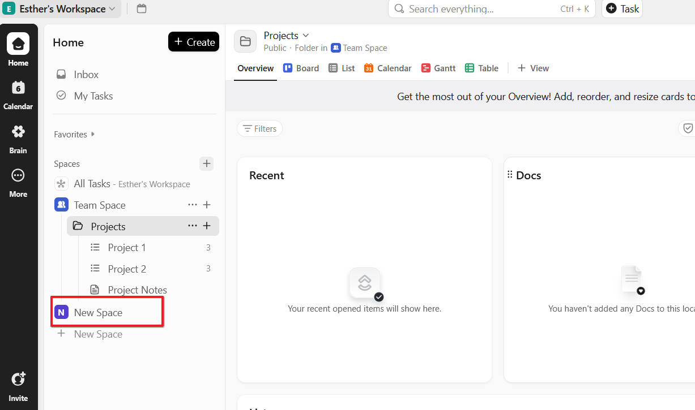
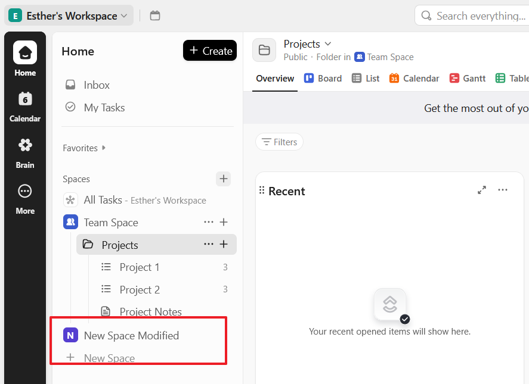
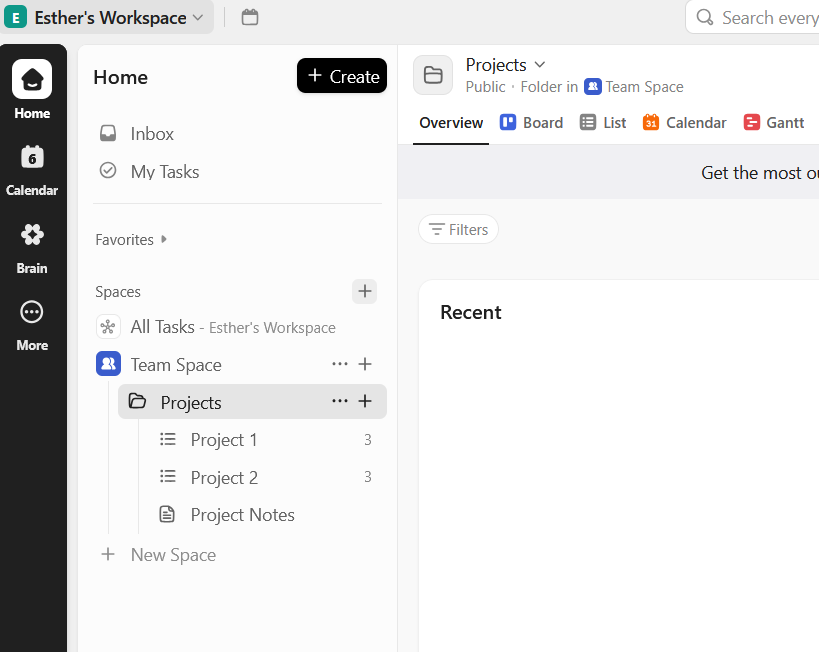

## API: https://app.clickup.com

## GET REQUEST 
> $ curl -X GET https://api.clickup.com/api/v2/team/90131593567/space -H "Authorization: $apitoken"

**Response**

>{"spaces":[{"id":"90136676231","name":"Team Space","color":"#03A2FD","private":false,"avatar":null,"admin_can_manage":true,"statuses":[{"id":"p90136676231_DCnaeiSB","status":"to do","type":"open","orderindex":0,"color":"#87909e"},{"id":"p90136676231_g9uxhsQM","status":"in progress","type":"custom","orderindex":1,"color":"#1090e0"},{"id":"p90136676231_syqLtYOY","status":"complete","type":"closed","orderindex":2,"color":"#008844"}],"multiple_assignees":true,"features":{"due_dates":{"enabled":true,"start_date":true,"remap_due_dates":true,"remap_closed_due_date":false},"sprints":{"enabled":false},"time_tracking":{"enabled":true,"harvest":false,"rollup":false,"default_to_billable":2},"points":{"enabled":false},"custom_items":{"enabled":false},"priorities":{"enabled":true,"priorities":[{"color":"#f50000","id":"1","orderindex":"1","priority":"urgent"},{"color":"#f8ae00","id":"2","orderindex":"2","priority":"high"},{"color":"#6fddff","id":"3","orderindex":"3","priority":"normal"},{"color":"#d8d8d8","id":"4","orderindex":"4","priority":"low"}]},"tags":{"enabled":true},"time_estimates":{"enabled":true,"rollup":false,"per_assignee":false},"check_unresolved":{"enabled":true,"subtasks":null,"checklists":null,"comments":null},"milestones":{"enabled":false},"custom_fields":{"enabled":true},"remap_dependencies":{"enabled":true},"dependency_warning":{"enabled":true},"status_pies":{"enabled":false},"multiple_assignees":{"enabled":true},"emails":{"enabled":true},"scheduler_enabled":false},"archived":false}]}

## POST REQUEST
> $ curl -X POST "https://api.clickup.com/api/v2/team/90131593567/space" -H "Authorization: $apitoken" -H "Content-Type: application/json" -d '{"name": "New Space","color": "#FF5733","icon": "star","hidden": false}'

**Response:**
> {"id":"90136783807","name":"New Space","color":null,"private":false,"avatar":null,"admin_can_manage":null,"statuses":[{"id":"p90136783807_xGnNOFr0","status":"to do","type":"open","orderindex":0,"color":"#87909e"},{"id":"p90136783807_8Mc7n2S8","status":"complete","type":"closed","orderindex":1,"color":"#008844"}],"multiple_assignees":false,"features":{"due_dates":{"enabled":true,"start_date":true,"remap_due_dates":false,"remap_closed_due_date":false},"sprints":{"enabled":false},"points":{"enabled":false},"custom_items":{"enabled":false},"checklists":{"enabled":true},"milestones":{"enabled":false},"remap_dependencies":{"enabled":true},"dependency_warning":{"enabled":true},"status_pies":{"enabled":true},"emails":{"enabled":true},"time_tracking":{"default_to_billable":2},"scheduler_enabled":false},"archived":false}

## PUT REQUEST

> $ curl -X PUT "https://api.clickup.com/api/v2/space/90136783807" -H "Authorization: $apitoken" -H "Content-Type: application/json" -d '{"name": "New Space Modified","color": "#FF5733","icon": "star","hidden": false}'

**Response**
>{"id":"90136783807","name":"New Space Modified","color":"#FF5733","private":false,"avatar":null,"admin_can_manage":null,"statuses":[{"id":"p90136783807_xGnNOFr0","status":"to do","type":"open","orderindex":0,"color":"#87909e"},{"id":"p90136783807_8Mc7n2S8","status":"complete","type":"closed","orderindex":1,"color":"#008844"}],"multiple_assignees":false,"features":{"due_dates":{"enabled":true,"start_date":true,"remap_due_dates":false,"remap_closed_due_date":false},"sprints":{"enabled":false},"points":{"enabled":false},"custom_items":{"enabled":false},"checklists":{"enabled":true},"milestones":{"enabled":false},"remap_dependencies":{"enabled":true},"dependency_warning":{"enabled":true},"status_pies":{"enabled":true},"emails":{"enabled":true},"time_tracking":{"default_to_billable":2},"scheduler_enabled":false},"archived":false}

## DELETE REQUEST
> $ curl -X DELETE "https://api.clickup.com/api/v2/space/90136783807" -H "Authorization: $apitoken"

**Response**
> {}

